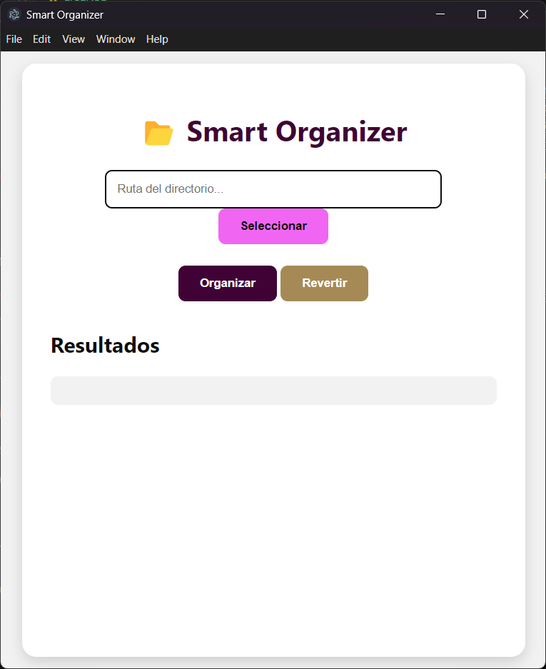
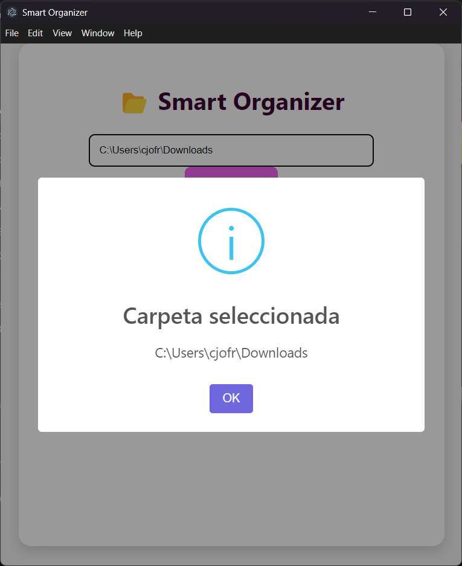
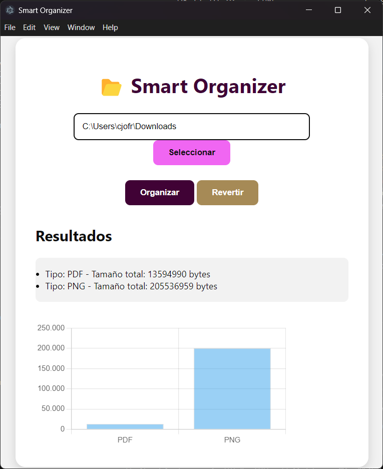
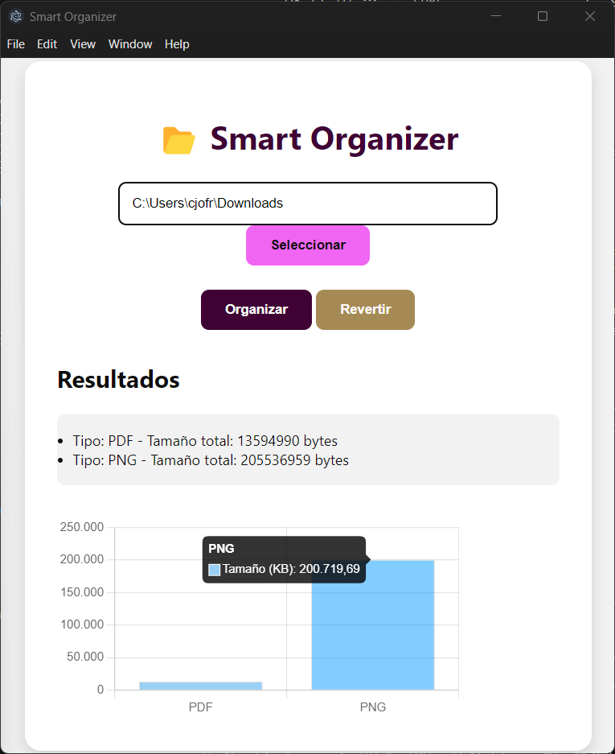
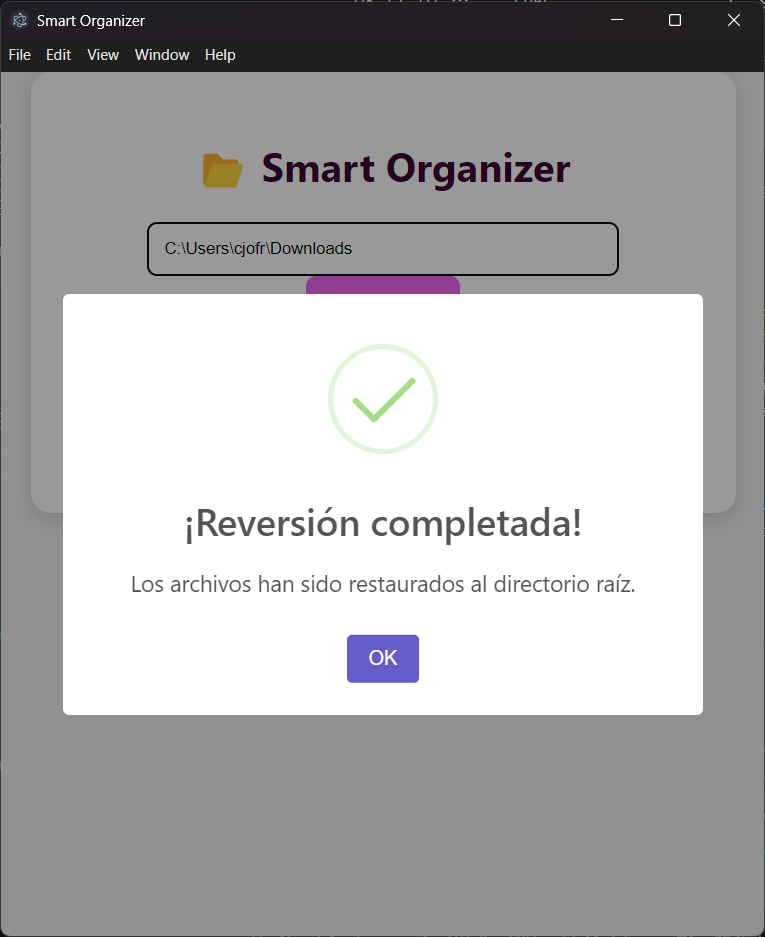
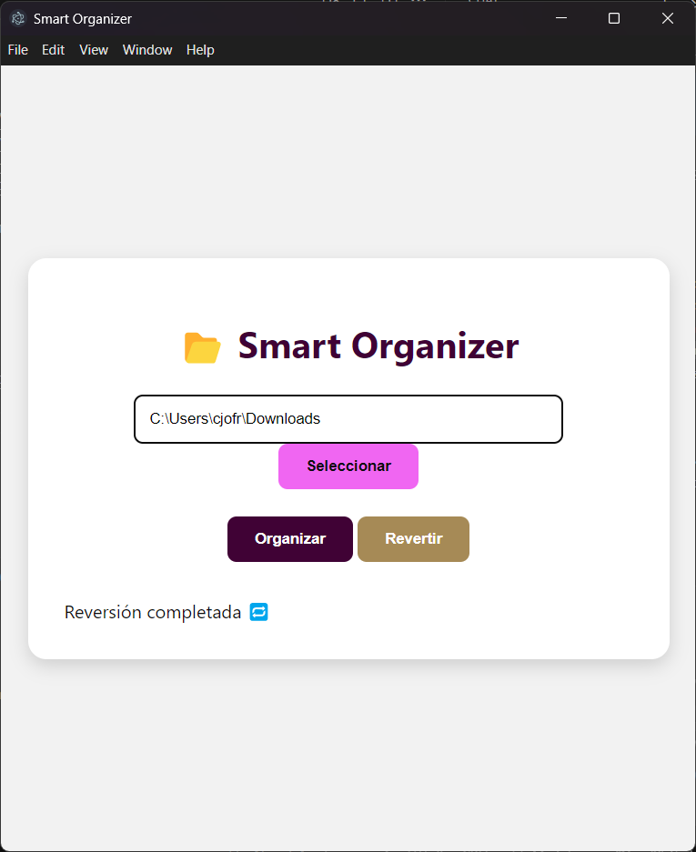
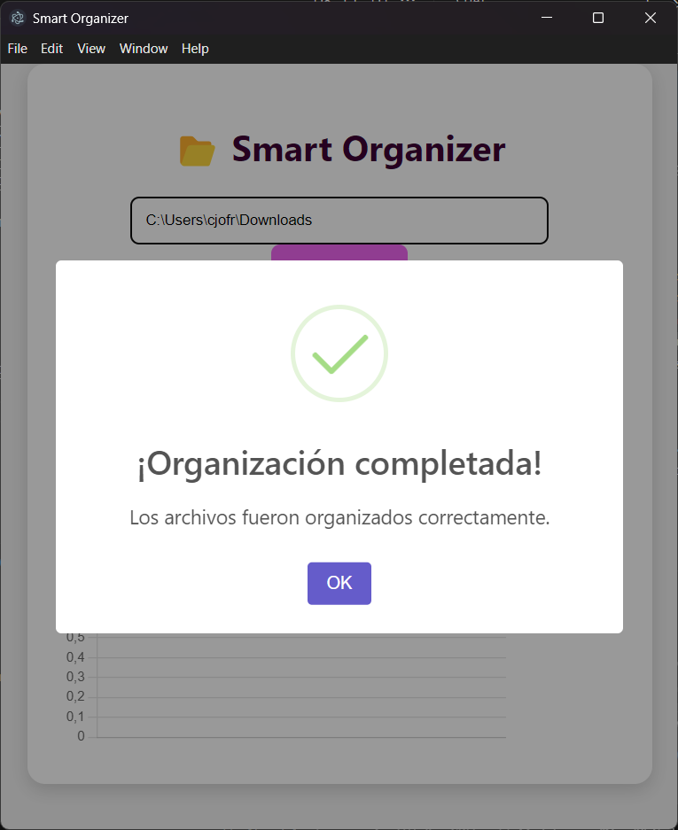
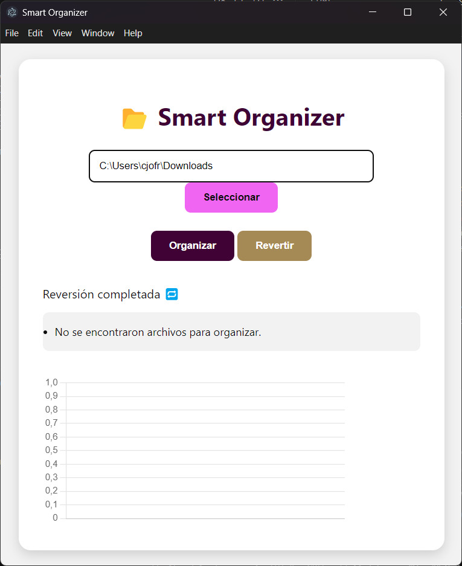

# 📂 Smart Organizer


Organizador inteligente de archivos para Windows, desarrollado con Electron. Clasifica, visualiza y gestiona tus archivos de manera eficiente y moderna.

---

## 📸 Ejemplo de pantalla

### Proceso completo de uso

1. Inicio de la aplicación
   
   

2. Selección de carpeta
   
   

3. Organización completada
   
   

4. Visualización de resultados y gráfico
   
   

5. Tooltip en gráfico
   
   

6. Reversión completada
   
   

7. Estado tras reversión
   
   

8. Organización sin archivos
   
   

9. Visualización de resultados y gráfico sin archivos para organizar
   
   

---

## Principales hitos del desarrollo

### 🎉 Inicialización del proyecto
- Estructura base con Electron y lógica modular.
- Archivos principales: `main.js`, `preload.js`, `logic/organizer.js`, `renderer/index.html`, `renderer/style.css`, `renderer/renderer.js`.

### ✨ Interfaz moderna
- UI limpia y responsiva.
- Botones para organizar, revertir y seleccionar carpeta.
- Notificaciones visuales con SweetAlert2.
- Gráficos dinámicos con Chart.js.

### 🔧 Refactor y robustez
- Corrección de ids y referencias en frontend.
- Elementos de resultados y gráfico siempre presentes.
- Reestructuración de carpetas y archivos.

### 🛡️ Debug y testing
- Logs de depuración detallados.
- Verificaciones para evitar errores y mejorar la experiencia de usuario.

### 🧹 Calidad de código
- Configuración de ESLint.
- Corrección automática de estilos y errores.

---

## 🚀 Instalación

1. Clona el repositorio:
   ```bash
   git clone https://github.com/N45h0/smart-organizer.git
   cd smart-organizer
   ```

2. Instala las dependencias:
   ```bash
   npm install
   ```

3. Inicia la aplicación en modo desarrollo:
   ```bash
   npm start
   ```

---

## 🖥️ Uso

1. Abre la app y selecciona la carpeta que deseas organizar.
2. Haz clic en **Organizar** para clasificar los archivos por tipo.
3. Visualiza el resumen y el gráfico de espacio ocupado.
4. Si lo deseas, puedes revertir la organización con el botón **Revertir**.

---

## ❓ Preguntas frecuentes (FAQ)

**¿Qué tipos de archivos organiza Smart Organizer?**  
Organiza cualquier archivo por su extensión, creando carpetas para cada tipo detectado.

**¿Puedo revertir la organización?**  
Sí, el botón "Revertir" restaura los archivos al directorio raíz.

**¿Funciona en Windows, Mac y Linux?**  
Actualmente está optimizado para Windows, pero puede adaptarse fácilmente a otros sistemas.

**¿Es seguro mover mis archivos?**  
Smart Organizer usa `fs-extra` para operaciones seguras. Sin embargo, siempre haz una copia de seguridad antes de organizar archivos importantes.

---

## 🆘 Soporte

¿Tienes dudas, sugerencias o encontraste un bug?  
Abre un issue en [GitHub Issues](https://github.com/N45h0/smart-organizer/issues) o contáctame por correo.

---

## 🤝 Contribuciones

¡Las contribuciones son bienvenidas!  
1. Haz un fork del repositorio.
2. Crea una rama con tu mejora (`git checkout -b feature/nueva-funcionalidad`).
3. Haz tus cambios y abre un pull request.

---

## 📄 Licencia

Este proyecto está bajo la licencia MIT.  
Consulta el archivo [LICENSE](LICENSE) para más detalles.

---

## 🙌 Agradecimientos

- A la comunidad de Electron por su documentación y soporte.
- A los desarrolladores de `fs-extra`, `chart.js` y `sweetalert2` por sus excelentes librerías.
- A todos los que prueban, reportan bugs y contribuyen a mejorar Smart Organizer.

---
